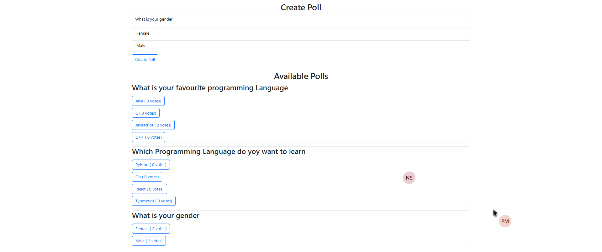

# AngularProject-votingapp
My Project is about Creating a PollingApp
 When I click on the CreatePoll it creates a new poll and updates into the sql database
 

 And a poll is created with the questions and options entered by the user
 

 This is my whole project 
 

 This is the Http methods Iam using to create polls and get polls
 

 This is the picture of my databse after user creating a new poll with question and options
 

 Entire Databse
 
  
